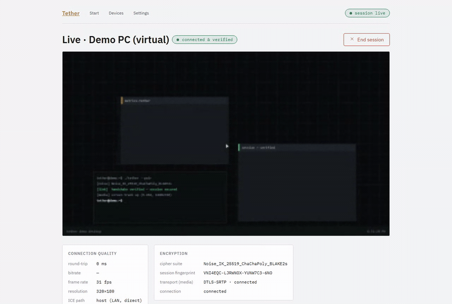

# Tether

**Pair two devices over an end-to-end encrypted channel, then watch one device's screen live on the other — with the server never able to read a thing.**

<p align="center"></p>

Tether is a cross-device continuity platform. Two devices exchange public keys (a QR or a short code), run a **Noise_IK** handshake so each proves it holds the private key behind the fingerprint the other scanned, and then stream screen video **peer-to-peer over WebRTC**. The rendezvous server only ever relays sealed blobs; it never holds a key that can decrypt a session.

## Try it in one command

```bash
git clone <repo> && cd tether
npm install
npm run dev
```

That bundles the web client, starts the broker, and opens `http://localhost:8080`. Click **Try the demo** and the page pairs with an in-page *virtual device* over the real broker, runs the real Noise handshake, and streams a synthetic desktop over a real WebRTC connection — no second machine, no config, no env file. Demo mode is additive: real two-device pairing over your LAN still works.

Requires Node 22.18+ (it runs TypeScript directly). Nothing else.

## Why it's interesting

- **The handshake is the product, and it's visible.** Pairing runs `Noise_IK_25519_ChaChaPoly_BLAKE2s` end-to-end inside the broker's opaque relay. The UI shows each step in plain language — register, watch, message 1, message 2, verified — and the resulting session fingerprint, so you can watch the cryptography complete instead of a spinner. One implementation of the handshake core runs in Node (`node:crypto`) and in the browser (audited `@noble/*` primitives), pinned to shared byte-level test vectors.
- **Zero-trust rendezvous.** The broker authenticates a device by proving its public key fingerprints to its device id, routes sealed relay blobs by id, and reports presence. It never parses a payload and never sees SDP, ICE, or media. The media path is P2P (host-to-host on a LAN; STUN/TURN only as a fallback), secured by DTLS-SRTP, and its identity is bound to the paired device because the SDP travels inside the Noise channel.
- **Capabilities are enforced, not assumed.** A session is gated by what both peers actually advertise (`negotiateSession`), so an impossible request — controlling a device with no injection API, splitting a call's mic and speaker — is refused at negotiation time with a reason, not discovered at runtime.

## Architecture

```
┌─────────────┐   register / relay / watch (WSS)   ┌─────────────┐
│  Device A   │◄─────────────────────────────────►│   Broker    │
│ (initiator) │        opaque sealed blobs         │ (zero-trust)│
└─────┬───────┘                                    └──────┬──────┘
      │              Noise_IK handshake                   │
      │◄════════════ inside relay blobs ═════════════════►│
      │                                                   │
      │   once paired: SDP + ICE inside the Noise channel │
      │◄════════════════════════════════════════════════►│
      │                                                   ▼
      │            WebRTC media (DTLS-SRTP), P2P      ┌─────────────┐
      └──────────────────────────────────────────────│  Device B   │
                    screen video, host-to-host        │ (responder) │
                                                       └─────────────┘
```

Full sequence and module map: [`docs/ARCHITECTURE.md`](docs/ARCHITECTURE.md). Feasibility spec (the contract): [`docs/SPEC.md`](docs/SPEC.md).

```
tether/
├── packages/protocol/   Noise_IK core (Node + browser backends), identity,
│                        broker messages, capability + codec negotiation
├── apps/server/         Rendezvous + signaling broker (zero runtime deps)
├── apps/web/            Browser client: pairing, screen view, the product UI
├── apps/reference-cli/  Reference Node client + self-contained pairing demo
├── apps/ios-bridge/     iPhone control over USB (WebDriverAgent via go-ios)
├── apps/android/        Phone client (Kotlin) — scaffold
└── apps/windows/        PC client (C++ + libwebrtc) — scaffold
```

## Real two-device pairing (LAN)

1. Once, in an **admin** PowerShell: `powershell -ExecutionPolicy Bypass -File scripts\allow-firewall.ps1` (opens inbound TCP 8080 on private networks and prints this PC's LAN address).
2. `npm run dev` on the PC, opened via `http://localhost:8080` (a secure context, required for screen capture).
3. Choose a mode, then **Pair a device (host)**. Scan the QR with the phone's camera, or type the 6-character code into Tether on the other device.
4. Both sides show the same verified fingerprint. Compare them — that is the trust anchor.

## Control an iPhone from the PC

An iPhone cannot be controlled by any App Store or web app; Apple exposes no injection API. The one route that works drives a developer-signed **WebDriverAgent** over USB with **go-ios**, which injects taps, drags, and typing and streams the screen. `apps/ios-bridge` wraps that, and the web client's **Control an iPhone** mode shows a live setup checklist. Full setup, prerequisites, and honest constraints: [`docs/IOS-CONTROL.md`](docs/IOS-CONTROL.md).

## Testing

```bash
npm test          # protocol, broker, negotiation, and the browser SecureLink
                  # reliability suite (pair, retry, timeout, displaced, reconnect)
npm run test:e2e  # Playwright: demo mode pairs and streams live video (Chromium)
npm run typecheck
```

## Current limitations (stated plainly)

- **LAN-only without TURN.** With no TURN server configured the app uses STUN and direct host candidates, so sessions across networks (behind CGNAT or symmetric NAT) will not connect. Add `TURN_URIS` + `TURN_SECRET`; see [`docs/DEPLOY.md`](docs/DEPLOY.md).
- **Browser screen sharing needs a Chromium browser opened via `localhost`.** `getDisplayMedia` requires a secure context; the LAN URL is not one. iPhone Safari has no screen-capture API, so a phone can view but not share.
- **A browser page cannot be controlled.** OS input injection needs the native clients (Android AccessibilityService, Windows SendInput) or, for iPhone, the USB bridge. The UI says so rather than pretending.
- **iPhone control is attended and USB-only,** with a developer-signed runner that a free Apple ID must re-sign weekly, and an MJPEG stream around 10–15 fps.
- **Android and Windows native clients are scaffolds.** The web client is the runnable cross-platform path today.

## License

Placeholder — see [`LICENSE`](LICENSE). Note the HEVC patent-pool exposure flagged in SPEC §4 before shipping a codec default.
