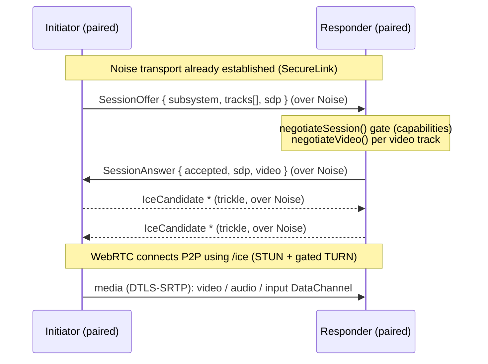

# Media & session layer (design)

How a paired device pair negotiates and carries real media — screen video, audio,
and live calls — on top of the encrypted control channel. Grounds out SPEC §2
(subsystems) and §4 (codecs/transport).

> **Status.** The negotiation logic and the control-message schema are
> implemented and tested in `packages/protocol` (`media.ts`, `session.ts`). The
> WebRTC media path itself is client-side and needs real devices to validate —
> this doc specifies it; the native clients implement it.

## Two planes

| Plane | Carries | Transport | Security |
|---|---|---|---|
| **Control** | pairing, session offer/answer, ICE, handoff, input events' setup | broker relay (pairing) then the **Noise-encrypted channel** (`SecureLink.send`) | Noise_IK (SPEC §4) |
| **Media** | screen video, audio, input DataChannel | **WebRTC** peer connection, P2P | DTLS-SRTP |

The broker only ever sees opaque pairing blobs. Session control (SDP/ICE) rides
inside the Noise channel, so the media plane's identity is bound to the paired
device — a MITM can't substitute its own SDP.

## Establishment sequence

1. **Offer.** The initiator builds a `SessionOffer` (subsystem + requested
   `tracks` + WebRTC SDP) and sends it over the Noise channel.
2. **Gate + negotiate.** The responder runs `negotiateSession()` (the §2
   feasibility gate — rejects controlling iOS, split-duplex audio, etc.) and,
   for each video track, `negotiateVideo()` (the §4 codec policy). It replies
   with a `SessionAnswer` carrying its SDP and the chosen `{codec, chroma}`.
3. **ICE.** Both sides trickle `IceCandidate` messages over the Noise channel.
   ICE servers come from the gated `GET /ice` (STUN + per-device TURN creds).
4. **Media.** The WebRTC peer connection establishes P2P (host → srflx → relay)
   and media flows over DTLS-SRTP.

## Track → subsystem mapping (SPEC §2)

| Subsystem | Track(s) | Source → encoder |
|---|---|---|
| Remote view (1) | `screen-video` | MediaProjection (Android) / Windows.Graphics.Capture → HW encoder → WebRTC video track |
| Remote control (1) | input **DataChannel** | events over an *unreliable, unordered* channel (`maxRetransmits: 0`) so loss never head-of-line-blocks the cursor (SPEC §4) |
| Responsibility routing (2) | `app-audio` / `mic-audio` | AudioPlaybackCapture / WASAPI loopback → Opus. **Whole-device only** |
| Live handoff (3) — own VoIP | `app-audio` | re-offer the audio track to the target device; `SessionHandoff` coordinates |
| Live handoff (3) — cellular | *(no media track)* | rides OS Bluetooth HFP; `SessionHandoff` only coordinates UI/state |

## Codec policy

Encoders run on the **source**, decoders on the **sink**. `negotiateVideo()`
implements, and `apps/server/test/media.test.ts` pins:

- **AV1 only PC→phone** — mid-range phones lack HW AV1 encode.
- **4:4:4 chroma prioritised over codec generation** — desktop text legibility.
- **HEVC preferred** on a chroma tie; **H.264 is the mandatory floor**.
- **Audio: Opus 1.6.x**, 10 ms frames, FEC + DRED (SPEC §4).

## Handoff (SPEC §2.3)

`SessionHandoff { toDeviceId }` moves an active session to another of the user's
devices. The target (already paired) receives a fresh `SessionOffer`; the old
leg gets `SessionClose`. For audio, the **entire acoustic loop moves to one
device** — we never split mic and speaker across devices (distributed AEC
diverges, SPEC §2.2), which `negotiateSession()` enforces by rejecting
`splitDuplexLoop`.

## Not yet designed / open

- **Adaptive bitrate & congestion control** tuning (WebRTC GCC defaults are too
  conservative for low-latency desktop; needs device measurement — SPEC §4).
- **Reconnection**: resuming a session after a transient network drop without a
  full re-pair.
- **Multi-track sync** for combined screen+audio sessions.

## Verified here vs. client-side

- **Verified (tests):** capability + codec negotiation, the control-message
  schema, and the §2/§4 rules they enforce.
- **Client-side (needs devices):** the WebRTC peer connection, HW encoder
  factories, capture/inject integration, and end-to-end latency against the
  ITU-T G.114 budget.
